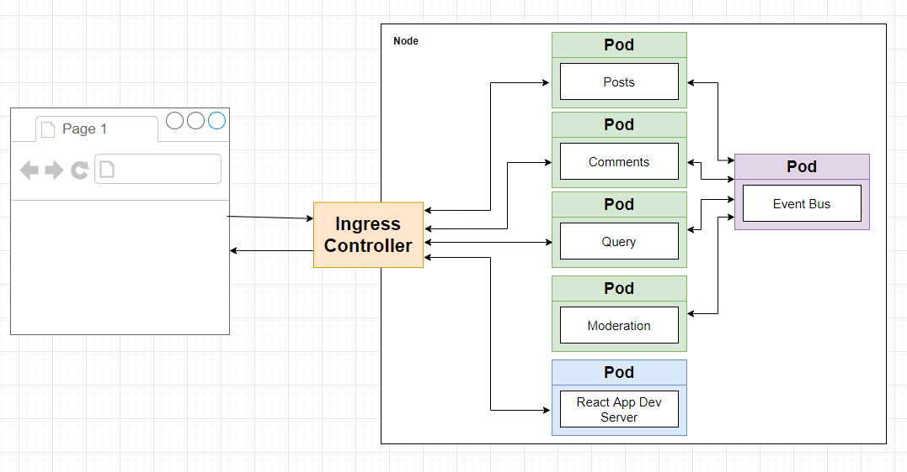
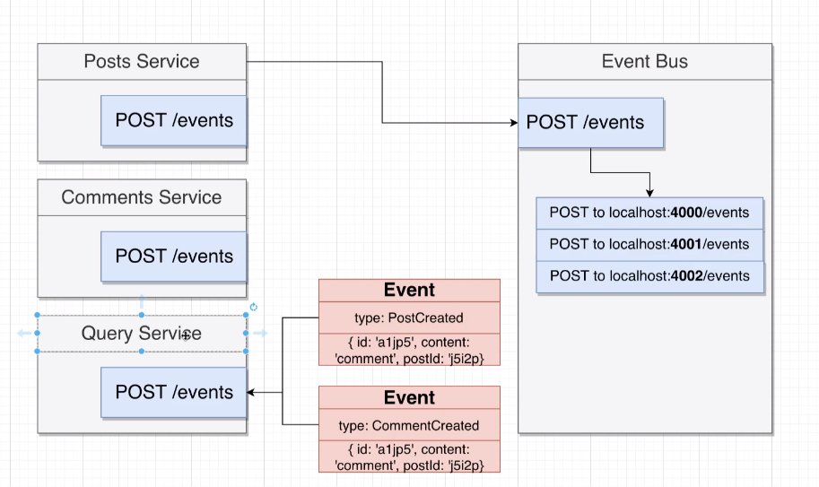

# A MINI MICROSERVICES APP

## A Micro Blog app

### Table of Contents

- [About the Projects](#about-the-project)
  - [Built With](#built-with)
- [Getting Started](#getting-started)
  - [Prerequisites](#prerequisites)
  - [Installation](#installation)
- [License](#license)
- [Contact](#contact)
- [Acknowledgements](#acknowledgements)

### About The Project

A micro blog application built on top of a microservices architecture as much as possible from scratch. It contains a client frontend and two backend microservices: posts and comments.




#### Built With

- [HTML](https://developer.mozilla.org/en-US/docs/Web/HTML)
- [CSS](https://developer.mozilla.org/en-US/docs/Web/CSS)
- [REACT](https://reactjs.org/)
- [create-react-app](https://github.com/facebook/create-react-app)
- [bootstrap](https://getbootstrap.com/)
- [express](https://expressjs.com/)
- [axios](https://axios-http.com/)
- [cors](https://github.com/expressjs/cors)
- [nodemon](https://nodemon.io/)
- [helmet](https://helmetjs.github.io/)
- [docker](https://www.docker.com/)
- [kubernetes](https://kubernetes.io/)

### Getting Started

To get a local copy up and running, follow these steps:

- Clone this repo locally:

  ```shell
  git clone git@github.com:DenysLins/mini-microservices-app.git
  cd mini-microservices-app
  ```

#### Prerequisites

- yarn

#### Installation

- To run the react frontend:

  ```shell
  cd client
  yarn
  yarn start
  ```

- To run the posts microservice:

  ```shell
  cd posts
  yarn
  yarn start
  ```

- To run the comments microservice:

  ```shell
  cd comments
  yarn
  yarn start
  ```

- To run the query microservice:

  ```shell
  cd query
  yarn
  yarn start
  ```

- To run the moderation microservice:

  ```shell
  cd moderation
  yarn
  yarn start
  ```

- To run the event bus microservice:

  ```shell
  cd event-bus
  yarn
  yarn start
  ```

### License

Distributed under the MIT License. See `LICENSE` for more information.

### Contact

Denys Lins

- Email: denyslins@gmail.com
- Twitter: [@Denys_Lins](https://twitter.com/Denys_Lins)
- Linkedin: [Denys Lins](https://www.linkedin.com/in/denyslins/?locale=en_US)

### Acknowledgements

- TODO
